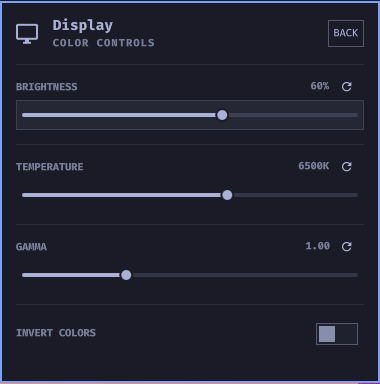

# Display & Color Controls for Omarchy

A drop-in replacement for the built-in `omarchy.monitor` Display widget that
keeps all of its familiar controls and adds an **Advanced color controls**
view backed by [`wl-gammarelay-rs`](https://github.com/MaxVerevkin/wl-gammarelay-rs).

Based on the Omarchy `omarchy.monitor` plugin.

<p align="center">
  <a href="https://github.com/tdownie0/omarchy-display-color-controls/tags"></a>
</p>

<p align="center">
  
</p>

## Features

- **Display panel** — the full `omarchy.monitor` experience:
  - Hardware brightness slider with OSD (internal, external, and DDC displays)
  - Scale presets for the focused display
  - Enable/disable display rows when multiple monitors are connected
  - Shell/GTK text-size slider
- **Advanced color controls** — new, via `wl-gammarelay-rs` over D-Bus:
  - Software brightness (1–100%)
  - Color temperature (1000K–10000K)
  - Gamma correction (0.10–3.00)
  - Invert colors toggle
  - One-click reset button per control (defaults: 100% · 6500K · 1.00 · off)
- Fully keyboard-navigable (`j`/`k`/`h`/`l` + Enter) and mouse-friendly
- Color changes apply per-monitor LUTs with no screen flicker

The Advanced view is hidden automatically when the `wl-gammarelay` D-Bus
service is not reachable — the panel degrades to the plain display controls.

## Requirements

- Omarchy with the standard Quickshell bar
- `wl-gammarelay-rs` — **AUR-only**, there is no official repo package
- An active Wayland graphical session (the service binds to
  `graphical-session.target`)

## Installation

### 1. Add and enable the plugin

```bash
omarchy plugin add https://github.com/tdownie0/omarchy-display-color-controls.git --enable
```

### 2. Install `wl-gammarelay-rs`

At this point, the plugin will be enabled, but the `Advanced` button will lead to an
empty menu. `wl-gammarelay-rs` is only in the AUR, so install it with the Omarchy
package helper (which wraps `yay`):

```bash
omarchy pkg aur add wl-gammarelay-rs
```

### 3. Install the bundled user service

The AUR package ships no systemd unit, so this plugin provides one. It follows
the same pattern Omarchy itself uses for daemons such as `hyprsunset.service`
(graphical-session scoped, auto-restart, `WAYLAND_DISPLAY`-guarded): 

```bash
install -Dm644 ~/.config/omarchy/plugins/io.github.tdownie0.monitor/wl-gammarelay.service ~/.config/systemd/user/
systemctl --user daemon-reload
systemctl --user enable --now wl-gammarelay.service
```

Verify it is up:

```bash
systemctl --user status wl-gammarelay.service
```

### 4. Replace the built-in Display widget

Disable the built-in:

```bash
omarchy plugin disable omarchy.monitor
```

The bar icon is the standard display glyph; To use the same
keybinding as before, `~/.config/hypr/bindings.lua` can be updated like so:

```lua
hl.unbind("SUPER + CTRL + D")
o.bind("SUPER + CTRL + D", "Display", "omarchy-shell shell toggle io.github.tdownie0.monitor")
```

## Usage

Click the display icon in the bar (or use your display panel shortcut) to open
the panel. The **main** view holds brightness, text size, scale, and display
controls. Press **ADVANCED** (or hover it) to switch to the color controls
view; **BACK** returns to the main view.

The color controls write directly to the `rs.wl.gammarelay` D-Bus object, so
changes also persist for session managers that snapshot gammarelay state.
Reset buttons restore the upstream defaults (100% brightness · 6500K ·
gamma 1.00 · colors not inverted).

## Removal

```bash
omarchy plugin remove io.github.tdownie0.monitor

# Optional: stop and remove the wl-gammarelay service
systemctl --user disable --now wl-gammarelay.service
rm ~/.config/systemd/user/wl-gammarelay.service

# Optional: remove the AUR package
omarchy pkg drop wl-gammarelay-rs

# Restore the stock Display widget
omarchy plugin enable omarchy.monitor --section right
```

## Dependencies

| Dependency | Where from | Purpose |
|------------|------------|---------|
| `omarchy.monitor` plugin | Omarchy (base) | Parent panel, model logic |
| `omarchy-brightness-display`, `omarchy-monitor-state`, `omarchy-hyprland-monitor-scaling`, `omarchy-display-text-size` | Omarchy (base) | CLI backends driven by the panel |
| `wl-gammarelay-rs` | AUR | D-Bus color/gamma service (`rs.wl-gammarelay`) |
| `busctl` | systemd | D-Bus reads/writes to `rs.wl.gammarelay` |
| `wl-gammarelay.service` | This repository | Bundled systemd user unit |

## License

MIT — see [LICENSE](LICENSE). Portions derived from the Omarchy project's
`omarchy.monitor` plugin.
